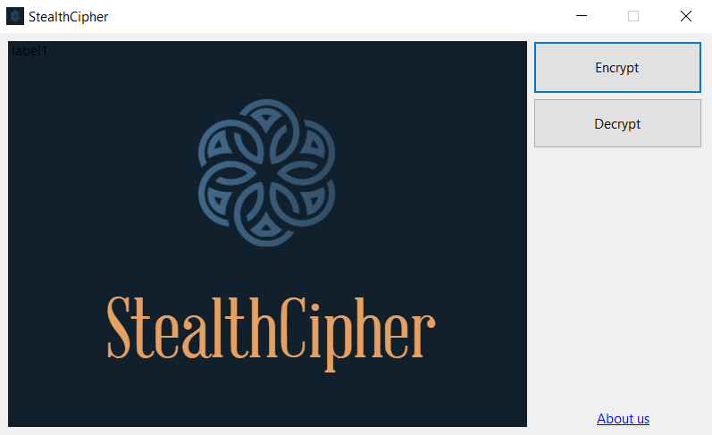
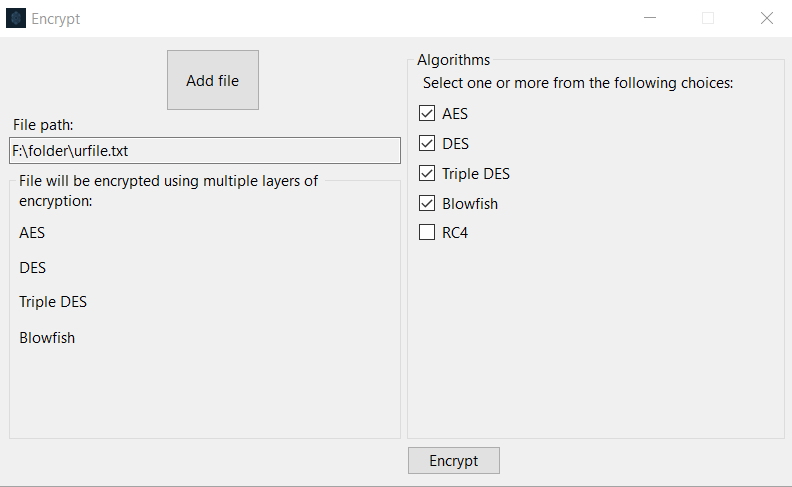
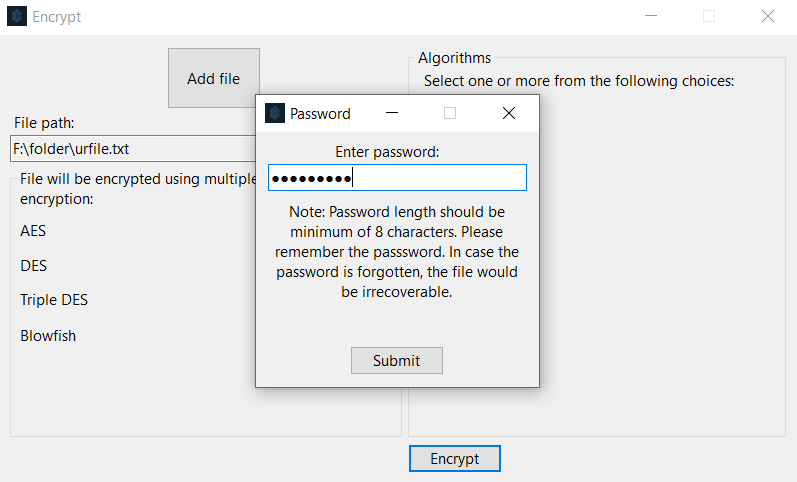
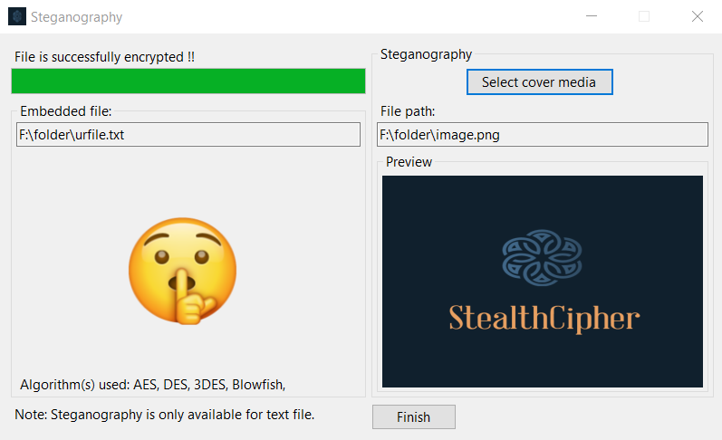
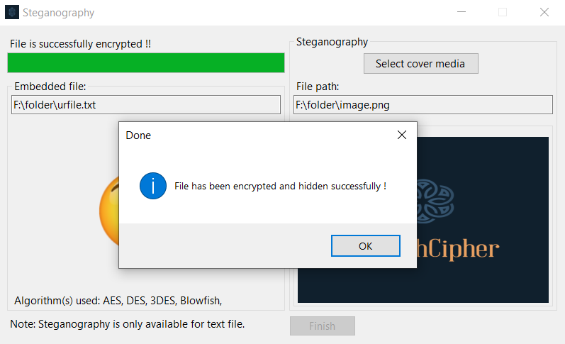
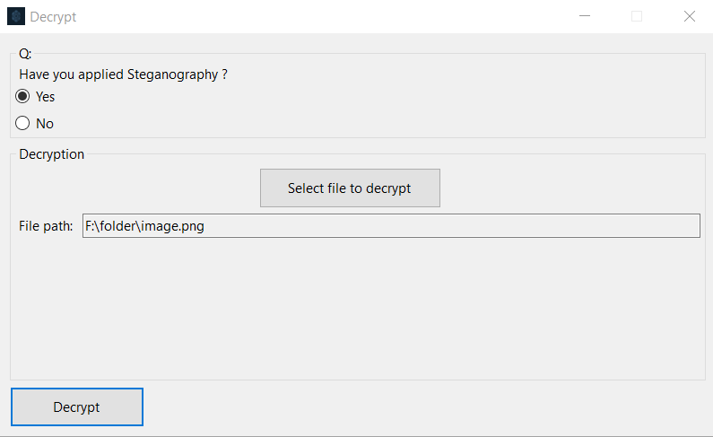
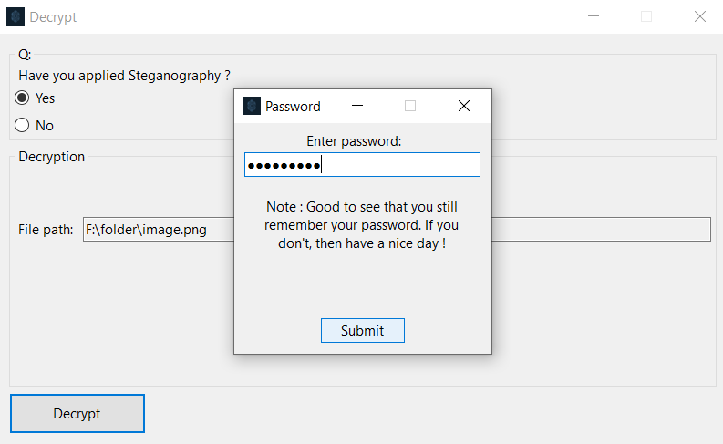
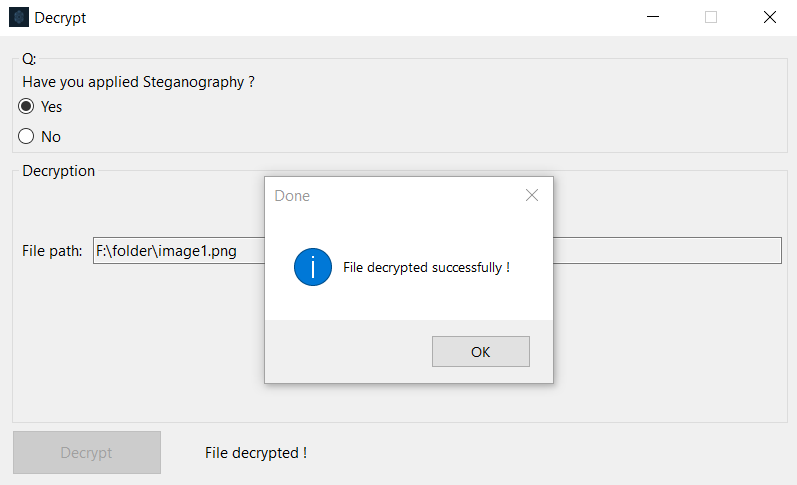

# StealthCipher
“StealthCipher” is a GUI based window application 
which takes any type of file as input and 
encrypts the file data with multiple layers of encryption algorithms like AES, DES, 3DES, Blowfish, RC4
and then steganography is used to hide the output in another file. 
 
 
 
 
 
 
 
 
